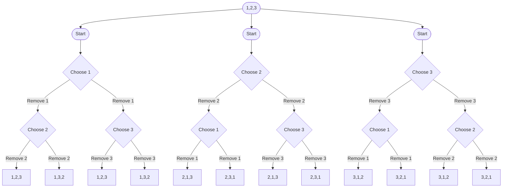
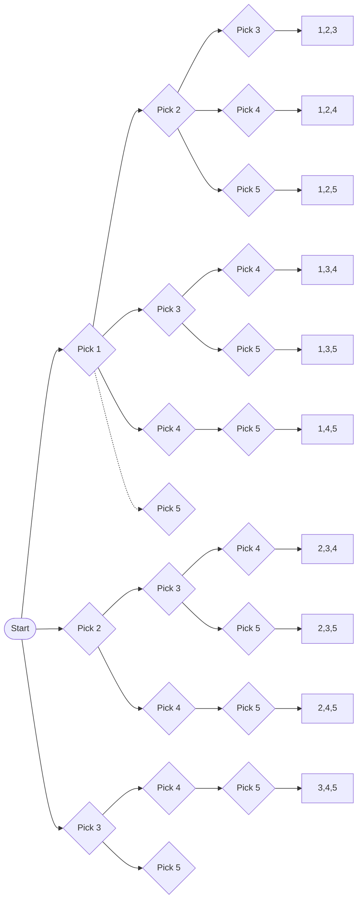

# Graph

## DFS

### permutation

```mermaid
graph TD
    Start([1,2,3]) --> A
    Start([1,2,3]) --> I
    Start([1,2,3]) --> Q
    A([Start]) --> B{Choose 1}
    B -->|Remove 1| C{Choose 2}
    B -->|Remove 1| D{Choose 3}
    C -->|Remove 2| E[1,2,3]
    C -->|Remove 2| F[1,3,2]
    D -->|Remove 3| G[1,2,3]
    D -->|Remove 3| H[1,3,2]

    I([Start]) --> J{Choose 2}
    J -->|Remove 2| K{Choose 1}
    J -->|Remove 2| L{Choose 3}
    K -->|Remove 1| M[2,1,3]
    K -->|Remove 1| N[2,3,1]
    L -->|Remove 3| O[2,1,3]
    L -->|Remove 3| P[2,3,1]

    Q([Start]) --> R{Choose 3}
    R -->|Remove 3| S{Choose 1}
    R -->|Remove 3| T{Choose 2}
    S -->|Remove 1| U[3,1,2]
    S -->|Remove 1| V[3,2,1]
    T -->|Remove 2| W[3,1,2]
    T -->|Remove 2| X[3,2,1]
```

### combination

```mermaid
graph LR
    Start([Start]) --> A{Pick 1}
    A --> B{Pick 2}
    A --> C{Pick 3}
    A --> D{Pick 4}
    B --> E{Pick 3}
    B --> F{Pick 4}
    B --> G{Pick 5}
    C --> H{Pick 4}
    C --> I{Pick 5}
    D --> J{Pick 5}
    E --> K[1,2,3]
    F --> L[1,2,4]
    G --> M[1,2,5]
    H --> N[1,3,4]
    I --> O[1,3,5]
    J --> P[1,4,5]
    A -.-> Q{Pick 5}
    Start --> R{Pick 2}
    R --> S{Pick 3}
    R --> T{Pick 4}
    S --> U{Pick 4}
    S --> V{Pick 5}
    T --> W{Pick 5}
    U --> X[2,3,4]
    V --> Y[2,3,5]
    W --> Z[2,4,5]
    Start --> A1{Pick 3}
    A1 --> A2{Pick 4}
    A1 --> A3{Pick 5}
    A2 --> A4{Pick 5}
    A4 --> A5[3,4,5]
```